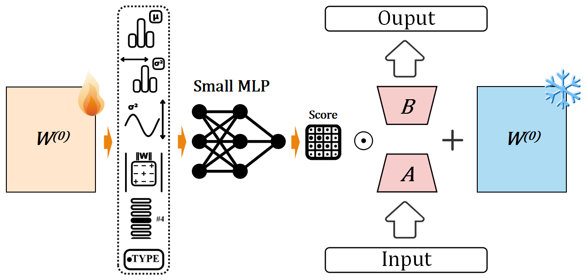

# BIM-LoRA: Blockwise Importance Modulation for Parameter-Efficient Fine-Tuning

This repository contains the code for the paper **“BIM-LoRA: Blockwise Importance Modulation for Parameter-Efficient Fine-Tuning.”**


## 🚀 Method Overview

<p align="center">
  
</p>

In Blockwise Importance Modeling, six blockwise features of the weight matrix are mapped by a small MLP to an importance score. In Joint Fine-Tuning with Blockwise Soft-Gating, the score yields a differentiable soft mask that reweights the LoRA increment in the forward pass.

---

## 📁 Repository Structure

```
BIM-LoRA/
├── bim_lora/
│   ├── __init__.py
│   ├── layers.py              # BIMLoRALinear: LoRA + blockwise soft-gating (mask on ΔW only)
│   ├── implicit_mlp.py        # six features → importance s∈[0,1] (init logits Z)
│   ├── feature_collector.py   # collect six blockwise features
│   ├── mask_allocator.py      # Optional: score/mask monitoring utilities
│   └── utils.py               # Module replacement, save/load helpers
│
├── examples/
│   ├── run_glue.py            # Unified entry for tasks
│   ├── trainer.py             # BIM-LoRA trainer
│   └── config.py              # Task defaults (overridable via CLI)
│
├── models/roberta-base/       # Pretrained model (or pass an HF identifier)
├── data/glue/                 # Dataset root
├── outputs/                   # logs / features / checkpoints
├── requirements.txt
└── README.md
```

---

## ⚙️ Installation

Use Python 3.10+ and a clean virtual environment:

```bash
git clone https://github.com/WbLiuBJTULab/BIM-LoRA.git
cd BIM-LoRA
pip install -r requirements.txt
```

> **GPU note.** Install a CUDA-matching `torch==2.7.1` per the official guide, then run the command above. `deepspeed` is optional.

---

## 📊 Data & Model Preparation

### Datasets

We follow the **official releases** used in the paper. You can obtain the data via either of the two common routes below:

* **HuggingFace Datasets** (recommended for convenience):

  * GLUE: `load_dataset("glue", <task>)`  (tasks used in our paper: **RTE, MRPC, STS‑B, CoLA, SST‑2, QQP, QNLI**; other GLUE tasks like MNLI/WNLI are also supported by the runner)
  * SQuAD v1.1: `load_dataset("squad")`
  * ARC (Easy/Challenge): `load_dataset("ARC-Easy"/"ARC-Challenge")`
  * XSum: `load_dataset("xsum")`

* **Original sources** (if you prefer the canonical websites): GLUE (NYU), SQuAD (Stanford), ARC (AI2), XSum（original release). Download the official splits and convert/arrange locally as below.

After obtaining the datasets via either route, **export/convert them to JSON arrays or TSV with headers and place them as follows** so that `examples/run_glue.py` can load them:

```
data/glue/             # or squad/, arc/, xsum/
  └── mrpc/            # or sst2/, qqp/, ...
      ├── train.json      (or train.tsv)
      ├── validation.json (or dev.tsv)
      └── test.json       (or test.tsv)
```

### Pretrained Model

* Set `--model_name_or_path` to a local folder (e.g., `./models/roberta-base`) or an HF identifier (e.g., `roberta-base`).
* Keep tokenizer files next to weights (e.g., `tokenizer.json`).

> **Tip.** Defaults in `examples/config.py` suit sentence-pair GLUE tasks. For other regimes, lightly retune `lr`, `mask_temperature` (and annealing), and sequence length.

---

## 🏃 Quick Start

Example on MRPC:

```bash
python -m examples.run_glue \
  --task_name mrpc \
  --model_name_or_path ./models/roberta-base \
  --data_dir ./data/glue \
  --output_dir ./outputs/mrpc \
  --seed 42
```

### Common CLI Arguments

Arguments override `examples/config.py`. Frequently adjusted:

```bash
--num_train_epochs
--per_device_train_batch_size --per_device_eval_batch_size
--learning_rate --warmup_ratio --max_seq_length
--gradient_accumulation_steps --eval_steps --save_steps --logging_steps
--lora_r --lora_alpha --lora_dropout
--block_size --collection_steps --mlp_epochs --mask_temperature
--fp16
```

**Metrics.** GLUE conventions: MRPC/QQP report Accuracy & F1, STS-B uses Pearson, CoLA uses MCC, others default to Accuracy.

---

## 🧪 Minimal API Usage

```python
from transformers import AutoModelForSequenceClassification
from examples.config import get_default_config
from bim_lora.utils import get_bim_lora_model

config = get_default_config(task_name="mrpc")
base = AutoModelForSequenceClassification.from_pretrained("models/roberta-base")
model = get_bim_lora_model(base, config)
```

For full experiments, use `examples/run_glue.py` together with `examples/trainer.py`.
